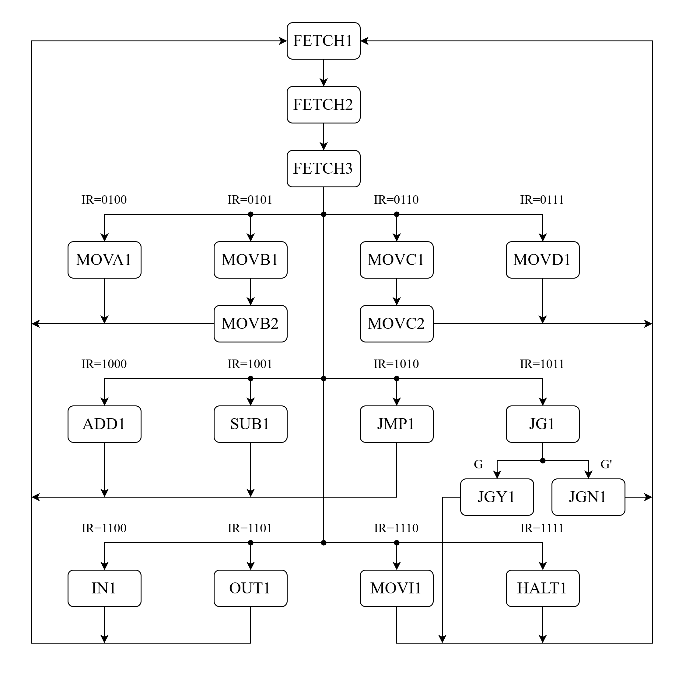
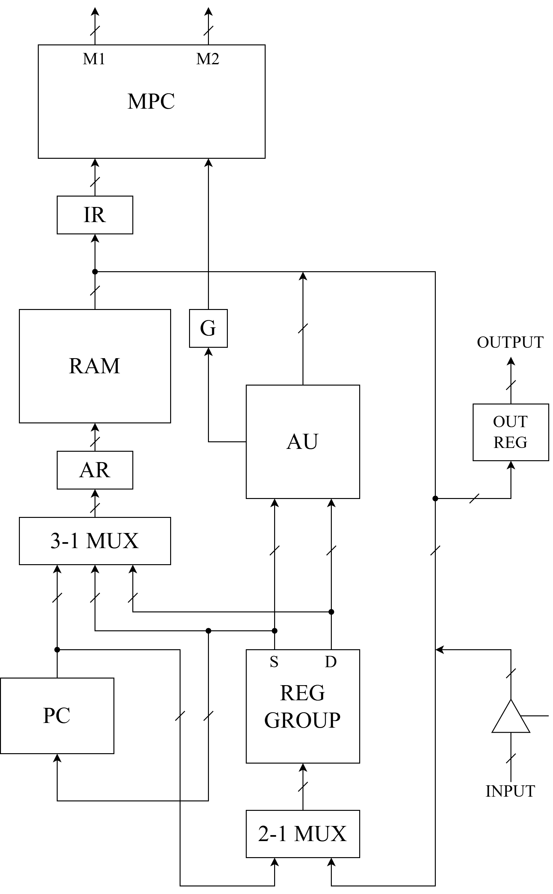
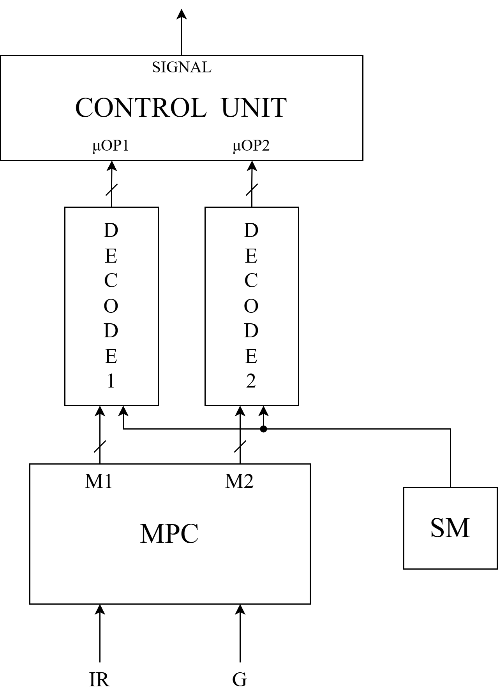
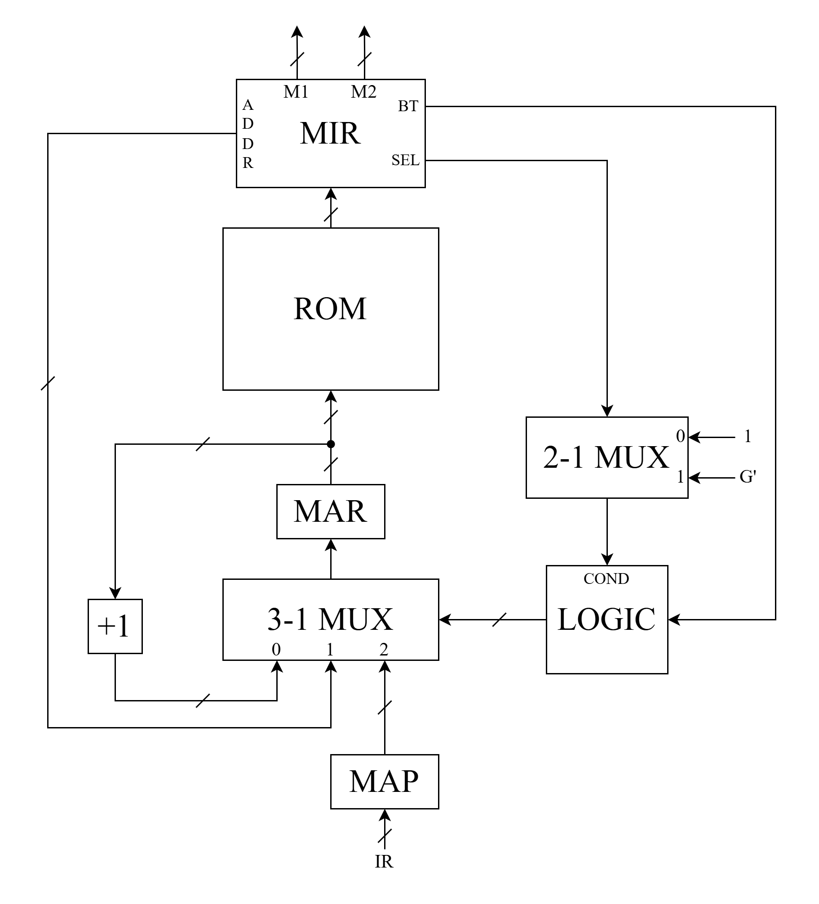

# 多周期微序列模型机

> 免责声明：
> 每年的模型机设计要求会有变化，本仓库仅用于思路参考与借鉴，切勿直接抄袭。

## 指令集

|指令|指令码|操作|
|---|---|---|
|MOVA  Rd, Rs|0100 RdRs|Rd←Rs|
|MOVB  M, Rs|0101 00Rs|M[R0]←Rs|
|MOVC  Rd, M|0110 Rd00|Rd←M[R0]|
|MOVD  R3, PC|0111 11XX|R3←PC|
|ADD  Rd, Rs|1000 RdRs|Rd←Rd+Rs|
|SUB  Rd, Rs|1001 RdRs|Rd←Rd-Rs, IF(Rd>Rd) THEN G←1 ELSE G←0|
|JMP|1010 XX11|PC←R3|
|JG|1011 XX11|IF(G=1) THEN PC←R3|
|IN  Rd|1100 RdXX|Rd←INPUT|
|OUT  Rs|1101 XXRs|OUTPUT←Rs|
|MOVI  IMM|1110 00XX IMM|R0←IMM|
|HALT|1111 0000|停机|

## 状态图

## CPU 整体架构

## 微程序控制单元

### 顶层架构

MPC输出的两个微操作代码接入微操作译码器，分别对两个域的微操作码进行译码产生微操作。

SM控制微操作的执行周期，接入两个微操作译码器。

### 全部微操作

|助记符|微操作|
|---|---|
|ARPC|AR←PC|
|PCIN|PC←PC+1|
|IRM|IR←M|
|RDRS|Rd←Rs|
|ARRS|AR←Rs|
|ARRD|AR←Rd|
|MRS|M←Rs|
|RDM|Rd←M|
|RDPC|Rd←PC|
|PLUS|Rd←Rs+Rd|
|MINU|Rd←Rd-Rs, SET G|
|PCRS|PC←Rs|
|RDIN|Rd←INPUT|
|OTRS|OUTPUT←Rs|
|NOP|NOP|

### 垂直微代码

将全部微操作分配进两个微操作域：

|域值|M1|M2|
|---|---|---|
|000|NOP|NOP|
|001|ARPC|IRM|
|010|PCIN|MRS|
|011|RDRS|RDM|
|100|ARRS|PLUS|
|101|ARRD|MINU|
|110|RDPC|RDIN|
|111|PCRS|OTRS|

各状态对应的微操作代码：

|状态|微操作1|微操作2|微操作代码|
|---|---|---|---|
|FETCH1|ARPC|/|001000|
|FETCH2|PCIN|IRM|010001|
|FETCH3|ARPC|/|001000|
|MOVA1|RDRS|/|011000|
|MOVB1|ARRD|/|101000|
|MOVB2|/|MRS|000010|
|MOVC1|ARRS|/|100000|
|MOVC2|/|RDM|000011|
|MOVD1|RDPC|/|110000|
|MOVI1|PCIN|RDM|010011|
|ADD1|/|PLUS|000100|
|SUB1|/|MINU|000101|
|JMP1|PCRS|/|111000|
|JG1|NOP|/|000000|
|JGY1|PCRS|/|111000|
|JGN1|NOP|/|000000|
|IN1|/|RDIN|000110|
|OUT1|/|OTRS|000111|
|HALT1|NOP|/|000000|

### 微序列控制器

微指令有3种下址：操作码映射、当前地址+1和绝对地址转移。模型机共19个状态，使用5位存储微指令地址。

采用`IR[7..4]0`作为映射函数。

采用以下分支逻辑：

|分支类型BT|条件COND|下址|
|---|---|---|
|0|0|当前地址+1|
|0|1|绝对地址|
|1|X|映射|

内部架构：

### 全部微代码

|状态|存储地址|SEL|BT|M1-M2|ADDR|
|---|---|---|---|---|---|
|FETCH1|0|0|0|001000|1|
|FETCH2|1|0|0|010001|2|
|FETCH3|2|0|1|001000|0|
|MOVA1|8|0|0|011000|0|
|MOVB1|10|0|0|101000|11|
|MOVB2|11|0|0|000010|0|
|MOVC1|12|0|0|100000|13|
|MOVC2|13|0|0|000011|0|
|MOVD1|14|0|0|110000|0|
|MOVI1|28|0|0|010011|0|
|ADD1|16|0|0|000100|0|
|SUB1|18|0|0|000101|0|
|JMP1|20|0|0|111000|0|
|JG1|22|1|0|000000|25|
|JGY1|23|0|0|111000|0|
|JGN1|25|0|0|000000|0|
|IN1|24|0|0|000110|0|
|OUT1|26|0|0|000111|0|
|HALT1|30|0|0|000000|30|

### 控制信号

SR控制信号为`IR[1..0]`，DR控制信号为`IR[3..2]`，AC控制信号为`IR[7..4]`。其他控制信号见下表：

|微操作|NOP|ARPC|PCIN|RDRS|ARRS|ARRD|RDPC|PCRS|IRM|MRS|RDM|PLUS|MINU|RDIN|OTRS|
|---|---|---|---|---|---|---|---|---|---|---|---|---|---|---|---|
|LD_AR|0|1|0|0|1|1|0|0|0|0|0|0|0|0|0|
|LD_PC|0|0|0|0|0|0|0|1|0|0|0|0|0|0|0|
|IN_PC|0|0|1|0|0|0|0|0|0|0|0|0|0|0|0|
|S[1..0]|00|00|00|00|01|10|00|00|00|00|00|00|00|00|00|
|WR|0|0|0|0|0|0|0|0|0|1|0|0|0|0|0|
|RE|0|0|0|0|0|0|0|0|1|0|1|0|0|0|0|
|LD_IR|0|0|0|0|0|0|0|0|1|0|0|0|0|0|0|
|S0|0|0|0|1|0|0|0|0|0|0|1|1|1|1|0|
|WE|0|0|0|1|0|0|1|0|0|0|1|1|1|1|0|
|AU_EN|0|0|0|1|0|0|0|0|0|1|0|1|1|0|1|
|G_EN|0|0|0|0|0|0|0|0|0|0|0|0|1|0|0|
|IN_EN|0|0|0|0|0|0|0|0|0|0|0|0|0|1|0|
|OUT_EN|0|0|0|0|0|0|0|0|0|0|0|0|0|0|1|